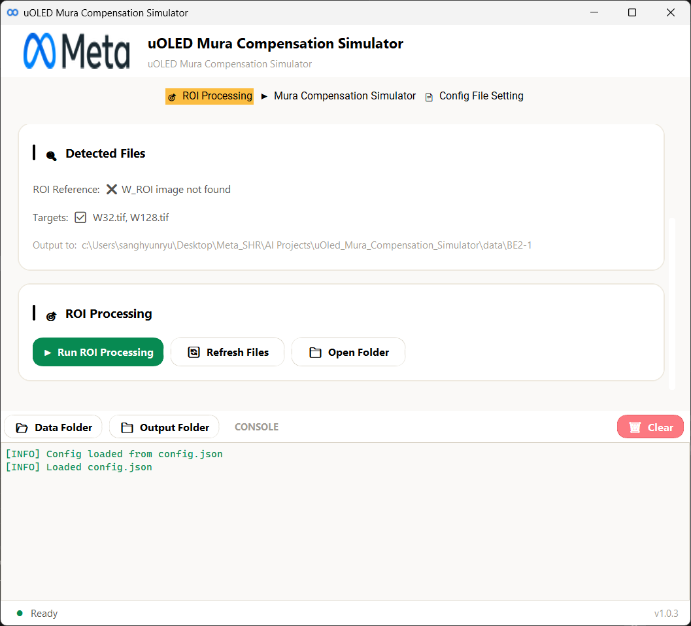
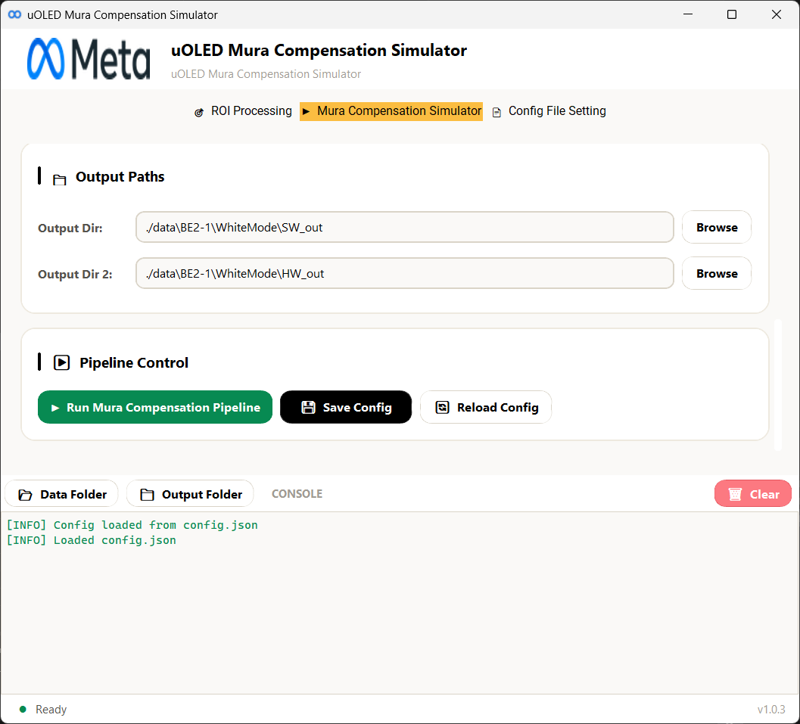
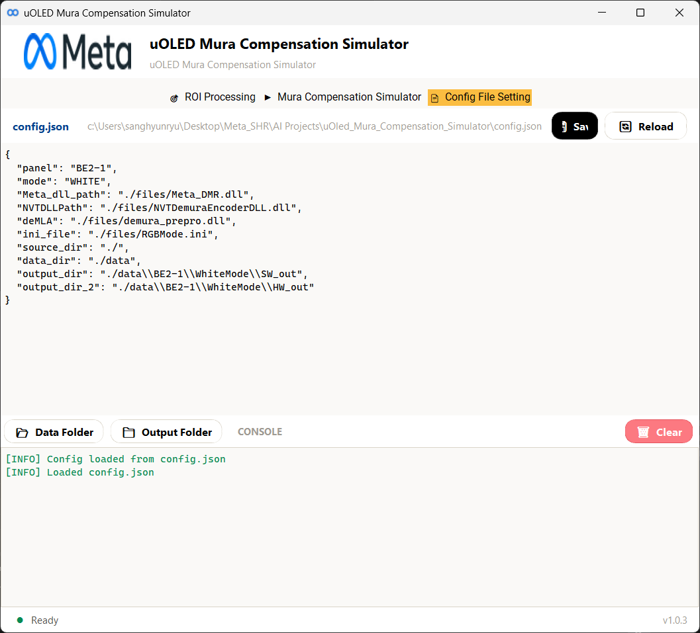

# uOLED Mura Compensation Simulator

**uOLED Mura Compensation Simulator v1.0.3**

A desktop GUI application for uOLED mura compensation simulation. It provides an end-to-end workflow — from ROI extraction of raw captured images through DeMLA preprocessing to demura bin/mcr file generation — with real-time console output. Built with [CustomTkinter](https://github.com/TomSchimansky/CustomTkinter).

---

## Screenshots

### ROI Processing Tab
Extract regions of interest from raw captured `.tif` images. Automatically detects W_ROI reference and target files (W32, W128) in the selected panel folder, then processes them via `roi_dll.dll`.



### Mura Compensation Simulator Tab
Configure output paths and run the full mura compensation pipeline — DeMLA preprocessing, Meta DLL processing, and NVT demura bin/mcr generation — with a single click.



### Config File Setting Tab
View and edit `config.json` directly within the application. Supports save and reload operations for quick parameter adjustments.



---

## Features

- **ROI Processing** — Extract regions of interest from raw `.tif` camera images using `roi_dll.dll`, outputs `.png` and `.csv` files per target
- **DeMLA Preprocessing** — Optional DeMLA (demura pre-processing) via `demura_prepro.dll` with selectable DLL versions
- **Demura Pipeline** — Full mura compensation pipeline: CSV data loading → DeMLA → Meta DLL → NVT DLL bin/mcr generation
- **Dual Mode Support** — RGB mode (Red/Green/Blue channels at 32/128 gray levels) and White mode (W32/W128)
- **Config Management** — JSON-based configuration with GUI controls for panel, mode, DLL paths, INI file, and output directories
- **INI File Selection** — Switch between RGBMode, WhiteMode, and their 1×1 variants
- **Real-time Console** — Live stdout capture from the demura pipeline with Data/Output folder shortcuts

---

## Project Structure

```
uOled_Mura_Compensation_Simulator/
├── main.py                    # Application entry point
├── demura_main.py             # CLI entry point (headless pipeline run)
├── demura_functions.py        # Meta_Demura class — core pipeline logic (DeMLA, Meta DLL, NVT DLL)
├── config.json                # Runtime configuration (panel, mode, DLL paths, output dirs)
├── app/
│   ├── __init__.py
│   ├── gui.py                 # Main window (DemuraGUI) — tab layout, header, shared console
│   ├── config.py              # Path constants, config load/save, panel/INI/DLL discovery
│   ├── simulator.py           # DemuraSimulator — background thread wrapper with stdout capture
│   ├── theme.py               # Color palette, fonts, spacing (Clay Light Mode Theme)
│   ├── widgets.py             # Reusable styled widgets (SectionCard, AccentButton, FormField, etc.)
│   ├── assets/                # Logo and icon files
│   └── tabs/
│       ├── run_tab.py         # Mura Compensation Simulator tab — config, INI, paths, pipeline run
│       ├── roi_tab.py         # ROI Processing tab — panel selection, file detection, ROI execution
│       └── editor_tab.py      # Config File Setting tab — JSON editor with save/reload
├── ROI/
│   ├── roi.py                 # ROI extraction core logic
│   ├── roi_run.py             # Python 3.12 subprocess wrapper for roi_dll.dll
│   ├── roi_dll.dll            # ROI extraction DLL (requires Python 3.12)
│   ├── roi_dll.h              # DLL header
│   └── roi_dll.lib            # DLL import library
├── files/
│   ├── Meta_DMR.dll           # Meta demura DLL
│   ├── NVTDemuraEncoderDLL.dll # NVT demura encoder DLL
│   ├── demura_prepro.dll      # DeMLA preprocessing DLL
│   ├── RGBMode.ini            # INI config for RGB mode
│   ├── WhiteMode.ini          # INI config for White mode
│   └── BRS_DMR_LUT_192.mcr   # Base MCR lookup table
├── data/                      # Panel data folders (CSV inputs, processing outputs)
│   ├── BE2-1/
│   └── D2/
└── docs/
    ├── ROI.png
    ├── config.png
    └── mura_compensation_simulator.png
```

---

## Requirements

- **Python** 3.13+ (main application)
- **Python** 3.12 (required for `roi_dll.dll` only)
- **Dependencies:**
  - [customtkinter](https://github.com/TomSchimansky/CustomTkinter) — Modern GUI framework
  - [Pillow](https://python-pillow.org/) — Image processing
  - [NumPy](https://numpy.org/) — Array operations
  - [pandas](https://pandas.pydata.org/) — CSV data loading

Install dependencies:

```bash
pip install customtkinter pillow numpy pandas
```

---

## Usage

### Run the GUI Application

```bash
python main.py
```

### Run Headless (CLI)

```bash
python demura_main.py
```

### Workflow

1. **ROI Processing** — In the *ROI Processing* tab:
   - Select a panel folder from `data/`
   - Ensure `W_ROI.tif` (reference) and target images (`W32.tif`, `W128.tif`) are present
   - Click *Run ROI Processing* to extract ROI regions → outputs `.png` and `.csv` files

2. **Configure Pipeline** — In the *Mura Compensation Simulator* tab:
   - Panel and Mode are auto-detected; select the appropriate INI file
   - Choose DeMLA DLL version (or skip DeMLA)
   - Set output directories for SW and HW outputs

3. **Run Compensation** — Click *Run Mura Compensation Pipeline*:
   - Step 1: Read CSV data + DeMLA preprocessing
   - Step 2: Meta DLL processing
   - Step 3: NVT DLL → generates `.mcr` and `.bin` files

4. **Check Results** — Output files are saved to the configured output directories:
   - `SW_out/` — Software output (MCR, TXT, BMP files)
   - `HW_out/` — Hardware output (BIN array files)

### Config File

Edit `config.json` directly or use the *Config File Setting* tab:

```json
{
  "panel": "BE2-1",
  "mode": "WHITE",
  "Meta_dll_path": "./files/Meta_DMR.dll",
  "NVTDLLPath": "./files/NVTDemuraEncoderDLL.dll",
  "deMLA": "./files/demura_prepro.dll",
  "ini_file": "./files/WhiteMode.ini",
  "source_dir": "./",
  "data_dir": "./data",
  "output_dir": "./data/BE2-1/WhiteMode/SW_out",
  "output_dir_2": "./data/BE2-1/WhiteMode/HW_out"
}
```

---

## License

Internal use only.
